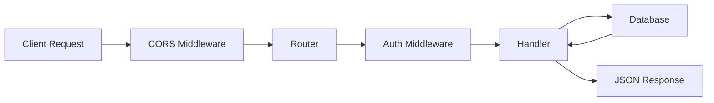
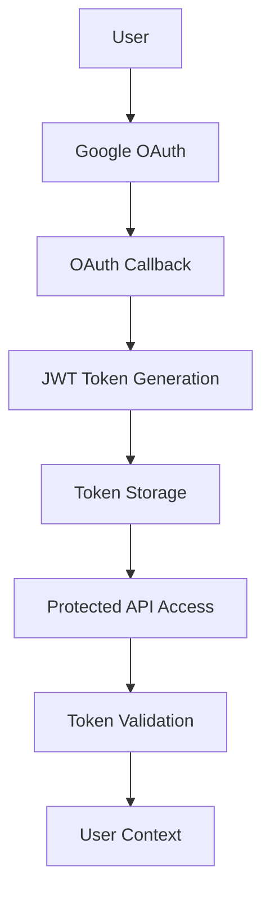
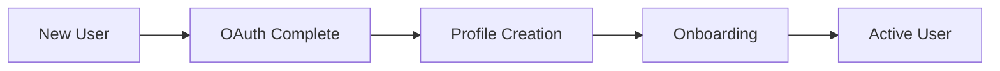
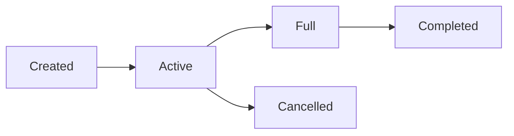

# 🏗️ API Overview

This document provides a comprehensive overview of the Juno Backend API architecture, design principles, and core patterns.

## 🎯 Design Philosophy

The Juno Backend follows these core principles:

- **🚀 Performance First** - Optimized for speed and scalability
- **🔒 Security by Design** - Authentication and authorization at every layer
- **📱 Mobile-Optimized** - Designed specifically for React Native clients
- **🌐 Cloud-Native** - Built for Google Cloud Run deployment
- **🧪 Testable** - Clean separation of concerns and dependency injection

## 🏛️ Architecture Patterns

### 📁 Project Structure Pattern

```
internal/
├── api/        # Business logic and handlers
├── auth/       # Authentication and authorization
├── database/   # Data access layer
├── middleware/ # Request/response processing
└── routes/     # URL routing and endpoint definition
```

### 🔄 Request Flow



1. **CORS Middleware** - Handles cross-origin requests
2. **Router** - Routes requests to appropriate handlers
3. **Auth Middleware** - Validates JWT tokens (for protected routes)
4. **Handler** - Processes business logic
5. **Database** - Data persistence layer
6. **Response** - JSON response with proper status codes

### 🔐 Authentication Architecture



## 📊 Data Flow Patterns

### 👤 User Profile Flow

```go
// Example: Profile Update Flow
func UpdateProfile(c *gin.Context) {
    // 1. Extract user context from JWT
    userID := c.GetString("userID")
    
    // 2. Parse request body
    var profileData map[string]interface{}
    c.ShouldBindJSON(&profileData)
    
    // 3. Update database
    err := updateEnhancedProfile(userID, profileData)
    
    // 4. Return updated profile
    profile, _ := getEnhancedProfile(userID)
    c.JSON(200, profile)
}
```

### 🚗 Ride Management Flow

```go
// Example: Ride Creation Flow
func CreateRide(c *gin.Context) {
    // 1. Validate user permissions
    userID := c.GetString("userID")
    
    // 2. Validate ride data
    var rideData map[string]interface{}
    err := validateRideData(rideData)
    
    // 3. Create ride in database
    rideID, err := createRideInDatabase(userID, rideData)
    
    // 4. Return created ride details
    ride, _ := getRideDetailsByID(rideID, userID)
    c.JSON(201, ride)
}
```

## 🔧 Core Components

### 🌐 Router Configuration

**File**: `internal/routes/routes.go`

```go
func SetupRoutes(cfg *configs.Config) *gin.Engine {
    r := gin.Default()
    
    // CORS for cross-origin requests
    r.Use(cors.New(cors.Config{
        AllowOrigins:     []string{"*"},
        AllowMethods:     []string{"GET", "POST", "PUT", "DELETE", "OPTIONS"},
        AllowHeaders:     []string{"*"},
        AllowCredentials: true,
    }))
    
    // Public routes (no authentication)
    r.GET("/health", healthCheck)
    r.GET("/auth/google", auth.GoogleLogin(cfg))
    r.GET("/auth/google/callback", auth.GoogleCallback(cfg))
    
    // Protected routes (JWT required)
    protected := r.Group("/")
    protected.Use(middleware.JWTAuthMiddleware())
    {
        // API endpoints...
    }
    
    return r
}
```

### 🔐 Authentication Middleware

**File**: `internal/middleware/auth.go`

The JWT middleware follows this pattern:

1. **Extract Token** - From `Authorization: Bearer <token>` header
2. **Validate Token** - Using JWT secret and signature verification
3. **Extract Claims** - User ID, email, and other metadata
4. **Set Context** - Make user data available to handlers

```go
func JWTAuthMiddleware() gin.HandlerFunc {
    return func(c *gin.Context) {
        // Token extraction and validation
        token, err := jwt.Parse(tokenString, func(token *jwt.Token) (interface{}, error) {
            return []byte(jwtSecret), nil
        })
        
        // Set user context
        c.Set("userID", userID)
        c.Set("email", email)
        c.Next()
    }
}
```

### 💾 Database Layer

**File**: `internal/database/connection.go`

The database layer provides:

- **Connection Management** - PostgreSQL connection pooling
- **Migration Support** - Schema versioning and updates
- **Transaction Support** - ACID compliance for complex operations

```go
func InitDB(cfg *configs.Config) {
    connStr := fmt.Sprintf("host=%s port=%s user=%s password=%s dbname=%s sslmode=require",
        cfg.DBHost, cfg.DBPort, cfg.DBUser, cfg.DBPassword, cfg.DBName)
    
    db, err := sql.Open("postgres", connStr)
    if err != nil {
        log.Fatal("Failed to connect to database")
    }
    
    DB = db
}
```

## 📡 API Response Patterns

### ✅ Success Responses

```json
{
  "status": "success",
  "data": {
    "id": 123,
    "name": "John Doe"
  },
  "message": "Operation completed successfully"
}
```

### ❌ Error Responses

```json
{
  "error": "Validation failed",
  "details": {
    "field": "email",
    "message": "Invalid email format"
  },
  "status": 400
}
```

### 📄 Paginated Responses

```json
{
  "data": [...],
  "pagination": {
    "page": 1,
    "limit": 20,
    "total": 150,
    "hasNext": true
  }
}
```

## 🔄 State Management

### 👤 User State

Users progress through various states:



### 🚗 Ride State

Rides follow a well-defined lifecycle:



## 🎛️ Configuration Management

**File**: `configs/config.go`

Configuration follows the 12-factor app methodology:

```go
type Config struct {
    Port               string  // Server port
    JWTSecret          string  // JWT signing secret
    GoogleClientID     string  // OAuth client ID
    GoogleClientSecret string  // OAuth client secret
    DBHost             string  // Database host
    DBPort             string  // Database port
    DBUser             string  // Database username
    DBPassword         string  // Database password
    DBName             string  // Database name
}
```

### Environment Priority

1. **Environment Variables** - Highest priority
2. **`.env` file** - Development only
3. **Default Values** - Fallback for non-critical settings

## 🧪 Testing Patterns

### Unit Tests

```go
func TestCreateRide(t *testing.T) {
    // Setup test database
    db := setupTestDB()
    defer db.Close()
    
    // Test ride creation
    rideData := map[string]interface{}{
        "origin": "Campus",
        "destination": "Airport",
        "departureTime": "2025-06-20T10:00:00Z",
    }
    
    rideID, err := createRideInDatabase("user123", rideData)
    assert.NoError(t, err)
    assert.NotEmpty(t, rideID)
}
```

### Integration Tests

```go
func TestAuthFlow(t *testing.T) {
    // Setup test server
    router := SetupRoutes(testConfig)
    
    // Test OAuth callback
    req := httptest.NewRequest("GET", "/auth/google/callback?code=test", nil)
    resp := httptest.NewRecorder()
    
    router.ServeHTTP(resp, req)
    assert.Equal(t, 200, resp.Code)
}
```

## 📈 Performance Considerations

### Database Optimization

- **Connection Pooling** - Reuse database connections
- **Query Optimization** - Use indexes and efficient queries
- **Lazy Loading** - Load related data only when needed

### Caching Strategy

```go
// Example: Profile caching
func getEnhancedProfile(userID string) (map[string]interface{}, error) {
    // Check cache first
    if cached := getFromCache("profile:" + userID); cached != nil {
        return cached, nil
    }
    
    // Query database
    profile := queryDatabase(userID)
    
    // Cache result
    setCache("profile:"+userID, profile, 15*time.Minute)
    
    return profile, nil
}
```

### Response Optimization

- **JSON Compression** - Gin automatically compresses responses
- **Field Selection** - Return only requested fields
- **Batch Operations** - Combine multiple operations where possible

## 🔒 Security Patterns

### Input Validation

```go
func validateRideData(data map[string]interface{}) error {
    required := []string{"origin", "destination", "departureTime"}
    
    for _, field := range required {
        if data[field] == nil || data[field] == "" {
            return fmt.Errorf("%s is required", field)
        }
    }
    
    return nil
}
```

### SQL Injection Prevention

```go
// ✅ Good: Using parameterized queries
err := db.QueryRow("SELECT * FROM users WHERE id = $1", userID).Scan(...)

// ❌ Bad: String concatenation
query := "SELECT * FROM users WHERE id = " + userID
```

### Authorization Checks

```go
func requireRideOwnership(c *gin.Context) {
    userID := c.GetString("userID")
    rideID := c.Param("id")
    
    // Check if user owns the ride
    var driverID string
    err := db.QueryRow("SELECT driver_id FROM rides WHERE id = $1", rideID).Scan(&driverID)
    
    if driverID != userID {
        c.JSON(403, gin.H{"error": "Access denied"})
        c.Abort()
        return
    }
    
    c.Next()
}
```

## 🚀 Scalability Patterns

### Horizontal Scaling

- **Stateless Design** - No server-side sessions
- **Database Connection Pooling** - Efficient resource usage
- **Load Balancer Ready** - Multiple instance support

### Vertical Scaling

- **Memory Optimization** - Efficient data structures
- **CPU Optimization** - Optimized algorithms
- **I/O Optimization** - Batch database operations

---

**Next**: Learn about [Authentication](./03-authentication.md) implementation details.
