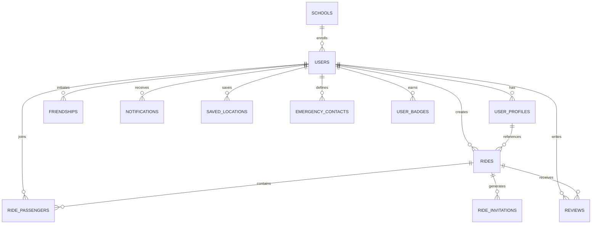
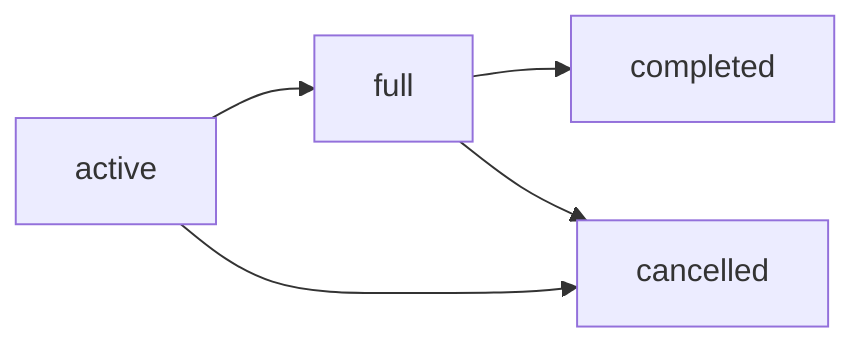
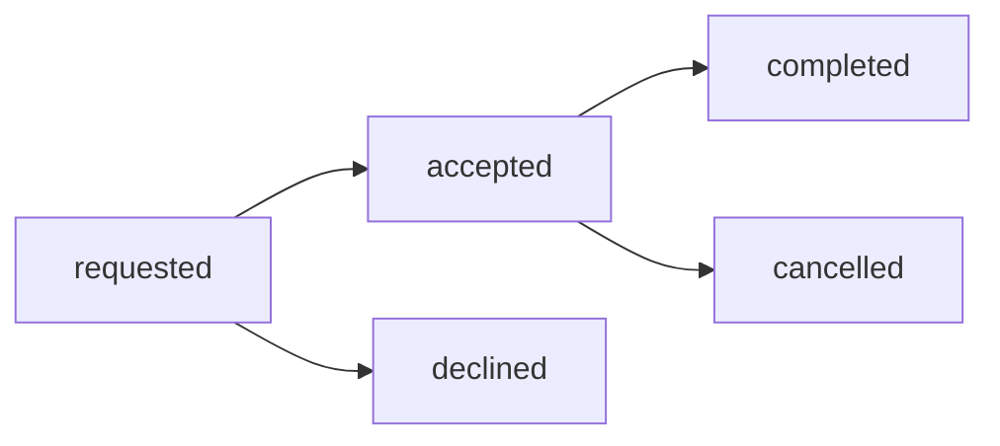

# 🗄️ Database Schema

Complete reference for the Juno Backend database schema, including all tables, relationships, constraints, and design decisions.

## 📊 Schema Overview

The Juno database is built on **PostgreSQL** and designed for a university rideshare application. It supports:

- **User Management** - Profiles, authentication, and onboarding
- **Rideshare Core** - Rides, passengers, and bookings
- **Social Features** - Friends, reviews, and notifications
- **Location Services** - Saved locations and school data
- **Safety Features** - Emergency contacts and verification

## 🎯 Entity Relationship Diagram



## 👥 User Management Tables

### `users` - Core User Information

Primary table for user authentication and basic profile data.

```sql
CREATE TABLE users (
    id SERIAL PRIMARY KEY,
    username VARCHAR(50) UNIQUE NOT NULL,
    email VARCHAR(255) UNIQUE NOT NULL,
    google_id VARCHAR(255) UNIQUE,
    first_name VARCHAR(100) NOT NULL,
    last_name VARCHAR(100) NOT NULL,
    phone VARCHAR(20),
    profile_picture_url TEXT,
    password_hash VARCHAR(255) NOT NULL DEFAULT 'google_oauth',
    email_verified BOOLEAN DEFAULT FALSE,
    is_active BOOLEAN DEFAULT TRUE,
    created_at TIMESTAMP DEFAULT CURRENT_TIMESTAMP,
    updated_at TIMESTAMP DEFAULT CURRENT_TIMESTAMP
);
```

| Field | Type | Description | Constraints |
|-------|------|-------------|-------------|
| `id` | SERIAL | Primary key | `PRIMARY KEY` |
| `username` | VARCHAR(50) | Unique username | `UNIQUE NOT NULL` |
| `email` | VARCHAR(255) | Email address | `UNIQUE NOT NULL` |
| `google_id` | VARCHAR(255) | Google OAuth ID | `UNIQUE` |
| `first_name` | VARCHAR(100) | First name | `NOT NULL` |
| `last_name` | VARCHAR(100) | Last name | `NOT NULL` |
| `phone` | VARCHAR(20) | Phone number | Optional |
| `profile_picture_url` | TEXT | Profile image URL | Optional |
| `password_hash` | VARCHAR(255) | Password hash | `DEFAULT 'google_oauth'` |
| `email_verified` | BOOLEAN | Email verification status | `DEFAULT FALSE` |
| `is_active` | BOOLEAN | Account status | `DEFAULT TRUE` |
| `created_at` | TIMESTAMP | Creation time | `DEFAULT CURRENT_TIMESTAMP` |
| `updated_at` | TIMESTAMP | Last update time | `DEFAULT CURRENT_TIMESTAMP` |

**Indexes**:
```sql
CREATE INDEX idx_users_email ON users(email);
CREATE INDEX idx_users_google_id ON users(google_id);
CREATE INDEX idx_users_username ON users(username);
```

### `user_profiles` - Extended User Information

Detailed user profile data including car information and preferences.

```sql
CREATE TABLE user_profiles (
    id SERIAL PRIMARY KEY,
    user_id INTEGER REFERENCES users(id) ON DELETE CASCADE,
    school VARCHAR(255) DEFAULT 'Freehold High School',
    class_year VARCHAR(10),
    major VARCHAR(255),
    bio TEXT,
    has_car BOOLEAN DEFAULT FALSE,
    car_make VARCHAR(100),
    car_model VARCHAR(100),
    car_color VARCHAR(50),
    car_year INTEGER,
    license_plate VARCHAR(20),
    max_passengers INTEGER DEFAULT 4 CHECK (max_passengers >= 1 AND max_passengers <= 8),
    driving_experience_years INTEGER DEFAULT 0,
    rating DECIMAL(3,2) DEFAULT 0.00 CHECK (rating >= 0 AND rating <= 5),
    total_rides_given INTEGER DEFAULT 0,
    total_rides_taken INTEGER DEFAULT 0,
    verification_status VARCHAR(20) DEFAULT 'unverified' CHECK (verification_status IN ('unverified', 'pending', 'verified')),
    emergency_contact_name VARCHAR(255),
    emergency_contact_phone VARCHAR(20),
    preferences JSONB DEFAULT '{}',
    created_at TIMESTAMP DEFAULT CURRENT_TIMESTAMP,
    updated_at TIMESTAMP DEFAULT CURRENT_TIMESTAMP,
    onboarding_completed BOOLEAN DEFAULT FALSE,
    onboarding_completed_at TIMESTAMP NULL,
    onboarding_step INTEGER DEFAULT 0,
    UNIQUE(user_id)
);
```

**Key Features**:
- **One-to-One** relationship with `users`
- **Car Information** - Make, model, color, year, passengers
- **Academic Info** - School, class year, major
- **Safety Features** - Emergency contacts, verification
- **Gamification** - Ratings, ride counts, badges
- **Onboarding** - Step tracking and completion status

**Business Rules**:
- `max_passengers` must be between 1 and 8
- `rating` must be between 0.00 and 5.00
- `verification_status` enum: `unverified`, `pending`, `verified`

## 🚗 Rideshare Core Tables

### `rides` - Ride Information

Core table for all ride offerings and requests.

```sql
CREATE TABLE rides (
    id SERIAL PRIMARY KEY,
    driver_id INTEGER REFERENCES users(id) ON DELETE CASCADE,
    origin_address TEXT NOT NULL,
    destination_address TEXT NOT NULL,
    origin_lat DECIMAL(10, 8),
    origin_lng DECIMAL(11, 8),
    destination_lat DECIMAL(10, 8),
    destination_lng DECIMAL(11, 8),
    departure_time TIMESTAMP NOT NULL,
    arrival_time TIMESTAMP,
    max_passengers INTEGER NOT NULL CHECK (max_passengers >= 1 AND max_passengers <= 8),
    current_passengers INTEGER DEFAULT 0,
    price_per_seat DECIMAL(10, 2) DEFAULT 0.00,
    currency VARCHAR(3) DEFAULT 'USD',
    description TEXT,
    status VARCHAR(20) DEFAULT 'active' CHECK (status IN ('active', 'full', 'completed', 'cancelled')),
    ride_type VARCHAR(20) DEFAULT 'one_time' CHECK (ride_type IN ('one_time', 'recurring')),
    recurring_pattern JSONB,
    school_related BOOLEAN DEFAULT TRUE,
    only_friends BOOLEAN DEFAULT FALSE,
    auto_accept BOOLEAN DEFAULT FALSE,
    special_requirements TEXT,
    created_at TIMESTAMP DEFAULT CURRENT_TIMESTAMP,
    updated_at TIMESTAMP DEFAULT CURRENT_TIMESTAMP
);
```

**Status Flow**:


**Key Features**:
- **Geolocation** - Latitude/longitude for origin and destination
- **Flexible Timing** - Departure and optional arrival times
- **Dynamic Capacity** - Current vs. maximum passengers
- **Pricing** - Per-seat pricing with currency support
- **Privacy Controls** - Friends-only and auto-accept options
- **Recurring Rides** - Support for regular commutes

### `ride_passengers` - Passenger Bookings

Junction table managing passenger bookings for rides.

```sql
CREATE TABLE ride_passengers (
    id SERIAL PRIMARY KEY,
    ride_id INTEGER REFERENCES rides(id) ON DELETE CASCADE,
    passenger_id INTEGER REFERENCES users(id) ON DELETE CASCADE,
    status VARCHAR(20) DEFAULT 'requested' CHECK (status IN ('requested', 'accepted', 'declined', 'cancelled', 'completed')),
    seat_number INTEGER,
    pickup_location TEXT,
    dropoff_location TEXT,
    pickup_lat DECIMAL(10, 8),
    pickup_lng DECIMAL(11, 8),
    dropoff_lat DECIMAL(10, 8),
    dropoff_lng DECIMAL(11, 8),
    payment_status VARCHAR(20) DEFAULT 'pending' CHECK (payment_status IN ('pending', 'paid', 'refunded')),
    amount_paid DECIMAL(10, 2) DEFAULT 0.00,
    rating_given INTEGER CHECK (rating_given >= 1 AND rating_given <= 5),
    review_text TEXT,
    created_at TIMESTAMP DEFAULT CURRENT_TIMESTAMP,
    updated_at TIMESTAMP DEFAULT CURRENT_TIMESTAMP,
    UNIQUE(ride_id, passenger_id)
);
```

**Passenger Status Flow**:


## 👫 Social Features Tables

### `friendships` - User Connections

Manages friend relationships between users.

```sql
CREATE TABLE friendships (
    id SERIAL PRIMARY KEY,
    user_id INTEGER REFERENCES users(id) ON DELETE CASCADE,
    friend_id INTEGER REFERENCES users(id) ON DELETE CASCADE,
    status VARCHAR(20) DEFAULT 'pending' CHECK (status IN ('pending', 'accepted', 'blocked', 'declined')),
    requested_by INTEGER REFERENCES users(id) ON DELETE CASCADE,
    created_at TIMESTAMP DEFAULT CURRENT_TIMESTAMP,
    updated_at TIMESTAMP DEFAULT CURRENT_TIMESTAMP,
    UNIQUE(user_id, friend_id),
    CHECK (user_id <> friend_id)
);
```

**Key Features**:
- **Bidirectional** - Creates reciprocal friendship records
- **Request Tracking** - Tracks who initiated the friendship
- **Status Management** - Pending, accepted, blocked, declined
- **Self-Prevention** - Users cannot friend themselves

**Friendship Logic**:
```sql
-- When User A sends friend request to User B:
INSERT INTO friendships (user_id, friend_id, status, requested_by) VALUES 
    (A, B, 'pending', A),
    (B, A, 'pending', A);

-- When User B accepts:
UPDATE friendships SET status = 'accepted' WHERE user_id IN (A, B) AND friend_id IN (A, B);
```

### `reviews` - User Ratings and Feedback

Reviews and ratings for drivers and passengers.

```sql
CREATE TABLE reviews (
    id SERIAL PRIMARY KEY,
    ride_id INTEGER REFERENCES rides(id) ON DELETE CASCADE,
    reviewer_id INTEGER REFERENCES users(id) ON DELETE CASCADE,
    reviewee_id INTEGER REFERENCES users(id) ON DELETE CASCADE,
    rating INTEGER NOT NULL CHECK (rating >= 1 AND rating <= 5),
    review_text TEXT,
    review_type VARCHAR(20) NOT NULL CHECK (review_type IN ('driver', 'passenger')),
    is_anonymous BOOLEAN DEFAULT FALSE,
    created_at TIMESTAMP DEFAULT CURRENT_TIMESTAMP,
    UNIQUE(ride_id, reviewer_id, reviewee_id)
);
```

## 🔔 Communication Tables

### `notifications` - User Notifications

System and user-generated notifications.

```sql
CREATE TABLE notifications (
    id SERIAL PRIMARY KEY,
    user_id INTEGER REFERENCES users(id) ON DELETE CASCADE,
    title VARCHAR(255) NOT NULL,
    message TEXT NOT NULL,
    type VARCHAR(50) NOT NULL CHECK (type IN ('friend_request', 'ride_request', 'ride_accepted', 'ride_declined', 'ride_cancelled', 'ride_reminder', 'system', 'payment')),
    related_user_id INTEGER REFERENCES users(id) ON DELETE SET NULL,
    related_ride_id INTEGER REFERENCES rides(id) ON DELETE SET NULL,
    data JSONB DEFAULT '{}',
    is_read BOOLEAN DEFAULT FALSE,
    is_deleted BOOLEAN DEFAULT FALSE,
    created_at TIMESTAMP DEFAULT CURRENT_TIMESTAMP,
    read_at TIMESTAMP
);
```

**Notification Types**:
- `friend_request` - Friend request sent/received
- `ride_request` - Passenger requested to join ride
- `ride_accepted` - Ride request approved
- `ride_declined` - Ride request denied
- `ride_cancelled` - Ride was cancelled
- `ride_reminder` - Upcoming ride reminder
- `system` - System announcements
- `payment` - Payment-related notifications

### `ride_invitations` - Direct Ride Invites

Direct invitations to specific users for rides.

```sql
CREATE TABLE ride_invitations (
    id SERIAL PRIMARY KEY,
    ride_id INTEGER REFERENCES rides(id) ON DELETE CASCADE,
    sender_id INTEGER REFERENCES users(id) ON DELETE CASCADE,
    recipient_id INTEGER REFERENCES users(id) ON DELETE CASCADE,
    message TEXT,
    status VARCHAR(20) DEFAULT 'pending' CHECK (status IN ('pending', 'accepted', 'declined', 'expired')),
    expires_at TIMESTAMP,
    created_at TIMESTAMP DEFAULT CURRENT_TIMESTAMP,
    responded_at TIMESTAMP,
    UNIQUE(ride_id, recipient_id)
);
```

## 📍 Location Tables

### `saved_locations` - User Saved Places

Frequently used locations saved by users.

```sql
CREATE TABLE saved_locations (
    id SERIAL PRIMARY KEY,
    user_id INTEGER REFERENCES users(id) ON DELETE CASCADE,
    name VARCHAR(100) NOT NULL,
    address TEXT NOT NULL,
    latitude DECIMAL(10, 8),
    longitude DECIMAL(11, 8),
    is_default BOOLEAN DEFAULT FALSE,
    location_type VARCHAR(20) DEFAULT 'other' CHECK (location_type IN ('home', 'work', 'school', 'other')),
    created_at TIMESTAMP DEFAULT CURRENT_TIMESTAMP
);
```

### `schools` - Educational Institutions

School data for user verification and location services.

```sql
CREATE TABLE schools (
    id SERIAL PRIMARY KEY,
    name VARCHAR(255) NOT NULL,
    domain VARCHAR(255),
    address TEXT,
    latitude DECIMAL(10, 8),
    longitude DECIMAL(11, 8),
    is_active BOOLEAN DEFAULT TRUE,
    created_at TIMESTAMP DEFAULT CURRENT_TIMESTAMP
);
```

## 🛡️ Safety Tables

### `emergency_contacts` - Emergency Contact Information

Emergency contacts for user safety.

```sql
CREATE TABLE emergency_contacts (
    id SERIAL PRIMARY KEY,
    user_id INTEGER REFERENCES users(id) ON DELETE CASCADE,
    name VARCHAR(255) NOT NULL,
    phone VARCHAR(20) NOT NULL,
    relationship VARCHAR(100),
    is_primary BOOLEAN DEFAULT FALSE,
    created_at TIMESTAMP DEFAULT CURRENT_TIMESTAMP
);
```

## 🏆 Gamification Tables

### `user_badges` - Achievement System

Badges and achievements for user engagement.

```sql
CREATE TABLE user_badges (
    id SERIAL PRIMARY KEY,
    user_id INTEGER REFERENCES users(id) ON DELETE CASCADE,
    badge_type VARCHAR(50) NOT NULL CHECK (badge_type IN ('top_rated', 'elite_rider', 'community_builder', 'safe_driver', 'eco_warrior', 'helpful_passenger')),
    badge_name VARCHAR(100) NOT NULL,
    badge_description TEXT,
    earned_at TIMESTAMP DEFAULT CURRENT_TIMESTAMP
);
```

**Badge Types**:
- `top_rated` - High rating achievement
- `elite_rider` - Frequent rider
- `community_builder` - Active in community features
- `safe_driver` - Safety-focused driving
- `eco_warrior` - Environmental consciousness
- `helpful_passenger` - Excellent passenger behavior

## 🔄 Database Triggers and Functions

### Automatic Passenger Count Updates

```sql
-- Trigger to update current_passengers count
CREATE OR REPLACE FUNCTION update_ride_passenger_count()
RETURNS TRIGGER AS $$
BEGIN
    IF TG_OP = 'INSERT' AND NEW.status = 'accepted' THEN
        UPDATE rides 
        SET current_passengers = current_passengers + 1,
            updated_at = CURRENT_TIMESTAMP
        WHERE id = NEW.ride_id;
    ELSIF TG_OP = 'UPDATE' THEN
        IF OLD.status != 'accepted' AND NEW.status = 'accepted' THEN
            UPDATE rides 
            SET current_passengers = current_passengers + 1,
                updated_at = CURRENT_TIMESTAMP
            WHERE id = NEW.ride_id;
        ELSIF OLD.status = 'accepted' AND NEW.status != 'accepted' THEN
            UPDATE rides 
            SET current_passengers = current_passengers - 1,
                updated_at = CURRENT_TIMESTAMP
            WHERE id = NEW.ride_id;
        END IF;
    ELSIF TG_OP = 'DELETE' AND OLD.status = 'accepted' THEN
        UPDATE rides 
        SET current_passengers = current_passengers - 1,
            updated_at = CURRENT_TIMESTAMP
        WHERE id = OLD.ride_id;
    END IF;
    
    RETURN COALESCE(NEW, OLD);
END;
$$ LANGUAGE plpgsql;

CREATE TRIGGER trigger_update_passenger_count
    AFTER INSERT OR UPDATE OR DELETE ON ride_passengers
    FOR EACH ROW EXECUTE FUNCTION update_ride_passenger_count();
```

### Automatic Ride Status Updates

```sql
-- Trigger to update ride status based on passenger count
CREATE OR REPLACE FUNCTION update_ride_status()
RETURNS TRIGGER AS $$
BEGIN
    -- Mark as full when max capacity reached
    IF NEW.current_passengers >= NEW.max_passengers THEN
        NEW.status = 'full';
    -- Reactivate if under capacity and was full
    ELSIF NEW.current_passengers < NEW.max_passengers AND NEW.status = 'full' THEN
        NEW.status = 'active';
    END IF;
    
    RETURN NEW;
END;
$$ LANGUAGE plpgsql;

CREATE TRIGGER trigger_update_ride_status
    BEFORE UPDATE ON rides
    FOR EACH ROW EXECUTE FUNCTION update_ride_status();
```

## 📊 Performance Indexes

### Primary Indexes

```sql
-- User-related indexes
CREATE INDEX idx_users_email ON users(email);
CREATE INDEX idx_users_google_id ON users(google_id);
CREATE INDEX idx_user_profiles_user_id ON user_profiles(user_id);

-- Ride-related indexes
CREATE INDEX idx_rides_driver_id ON rides(driver_id);
CREATE INDEX idx_rides_status ON rides(status);
CREATE INDEX idx_rides_departure_time ON rides(departure_time);
CREATE INDEX idx_rides_school_related ON rides(school_related);
CREATE INDEX idx_rides_only_friends ON rides(only_friends);

-- Passenger-related indexes
CREATE INDEX idx_ride_passengers_ride_id ON ride_passengers(ride_id);
CREATE INDEX idx_ride_passengers_passenger_id ON ride_passengers(passenger_id);
CREATE INDEX idx_ride_passengers_status ON ride_passengers(status);

-- Friendship indexes
CREATE INDEX idx_friendships_user_id ON friendships(user_id);
CREATE INDEX idx_friendships_friend_id ON friendships(friend_id);
CREATE INDEX idx_friendships_status ON friendships(status);

-- Notification indexes
CREATE INDEX idx_notifications_user_id ON notifications(user_id);
CREATE INDEX idx_notifications_is_read ON notifications(is_read);
CREATE INDEX idx_notifications_type ON notifications(type);
```

### Composite Indexes

```sql
-- Geospatial indexes for location-based queries
CREATE INDEX idx_rides_location ON rides(origin_lat, origin_lng, destination_lat, destination_lng);

-- Time-based queries
CREATE INDEX idx_rides_status_time ON rides(status, departure_time);

-- User activity indexes
CREATE INDEX idx_ride_passengers_user_status ON ride_passengers(passenger_id, status);
CREATE INDEX idx_friendships_user_status ON friendships(user_id, status);
```

## 🔍 Common Query Patterns

### User Profile with Ride Statistics

```sql
SELECT 
    u.id, u.username, u.email, u.first_name, u.last_name,
    up.school, up.class_year, up.major, up.bio, up.has_car,
    up.rating, up.total_rides_given, up.total_rides_taken,
    up.onboarding_completed, up.onboarding_step
FROM users u
LEFT JOIN user_profiles up ON u.id = up.user_id
WHERE u.id = $1;
```

### Active Rides with Driver Information

```sql
SELECT 
    r.id, r.origin_address, r.destination_address,
    r.departure_time, r.max_passengers, r.current_passengers,
    r.price_per_seat, r.description,
    u.first_name, u.last_name, up.rating as driver_rating
FROM rides r
JOIN users u ON r.driver_id = u.id
LEFT JOIN user_profiles up ON u.id = up.user_id
WHERE r.status = 'active'
    AND r.departure_time > CURRENT_TIMESTAMP
ORDER BY r.departure_time;
```

### Friend List with Mutual Information

```sql
SELECT 
    u.id, u.first_name, u.last_name, u.profile_picture_url,
    up.school, up.rating,
    f.created_at as friendship_date
FROM friendships f
JOIN users u ON f.friend_id = u.id
LEFT JOIN user_profiles up ON u.id = up.user_id
WHERE f.user_id = $1 
    AND f.status = 'accepted'
ORDER BY u.first_name, u.last_name;
```

## 🚨 Data Constraints and Validation

### Business Rule Constraints

```sql
-- Prevent self-friendship
ALTER TABLE friendships ADD CONSTRAINT check_no_self_friendship 
    CHECK (user_id <> friend_id);

-- Ensure valid ratings
ALTER TABLE user_profiles ADD CONSTRAINT check_valid_rating 
    CHECK (rating >= 0 AND rating <= 5);

-- Ensure valid passenger limits
ALTER TABLE rides ADD CONSTRAINT check_passenger_limits 
    CHECK (max_passengers >= 1 AND max_passengers <= 8);
    
-- Ensure current passengers doesn't exceed max
ALTER TABLE rides ADD CONSTRAINT check_current_vs_max_passengers 
    CHECK (current_passengers <= max_passengers);

-- Ensure departure time is in the future for new rides
ALTER TABLE rides ADD CONSTRAINT check_future_departure 
    CHECK (departure_time > created_at);
```

### Data Integrity Rules

- **Cascade Deletes** - When a user is deleted, all related data is removed
- **Unique Constraints** - Prevent duplicate relationships and bookings
- **Foreign Key Constraints** - Maintain referential integrity
- **Check Constraints** - Enforce business rules at database level

## 📈 Schema Migration Strategy

### Version Control

Each schema change includes:

1. **Migration Script** - Forward migration
2. **Rollback Script** - Reverse migration
3. **Version Number** - Sequential numbering
4. **Description** - Change documentation

### Example Migration

```sql
-- Migration: 001_add_car_year_to_user_profiles.sql
-- Description: Add car year field to user profiles

BEGIN;

-- Add new column
ALTER TABLE user_profiles 
ADD COLUMN car_year INTEGER;

-- Add constraint for valid years
ALTER TABLE user_profiles 
ADD CONSTRAINT check_valid_car_year 
CHECK (car_year IS NULL OR (car_year >= 1900 AND car_year <= 2030));

-- Update schema version
INSERT INTO schema_migrations (version, description, applied_at) 
VALUES ('001', 'Add car year to user profiles', CURRENT_TIMESTAMP);

COMMIT;
```

---

**Next**: Explore detailed [API Endpoints](./05-api-endpoints.md) documentation.
