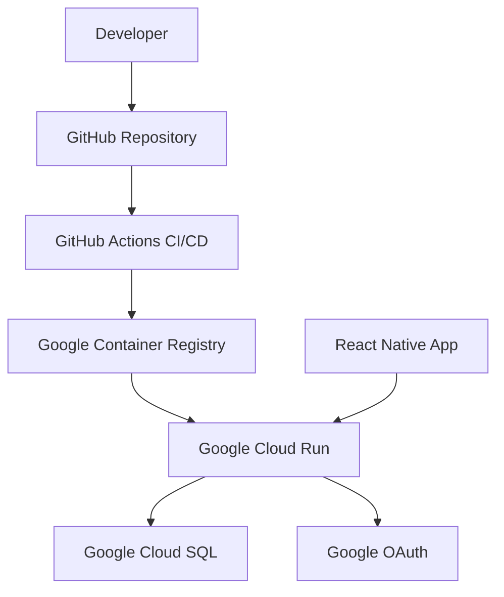

# 🚀 Deployment

Complete guide to deploying the Juno Backend to Google Cloud Run, including environment setup, CI/CD, and production best practices.

## 🎯 Deployment Overview

The Juno Backend is designed for **Google Cloud Run** deployment, providing:

- **🌐 Serverless Scaling** - Automatic scaling based on traffic
- **💰 Cost Effective** - Pay only for actual usage
- **🔒 Secure** - Managed security and SSL certificates
- **🚀 Fast Deployments** - Container-based deployment
- **🌍 Global** - Multi-region availability

## 🏗️ Architecture Overview



**Production Infrastructure**:
- **Cloud Run Service**: `juno-backend-587837548118.us-east4.run.app`
- **Database**: Google Cloud SQL (PostgreSQL)
- **Authentication**: Google OAuth 2.0
- **Storage**: Google Cloud Storage (future)

## 🔧 Prerequisites

### Google Cloud Setup

1. **Create Google Cloud Project**
```bash
# Install Google Cloud CLI
curl https://sdk.cloud.google.com | bash
exec -l $SHELL

# Login and set project
gcloud auth login
gcloud config set project YOUR_PROJECT_ID
```

2. **Enable Required APIs**
```bash
gcloud services enable run.googleapis.com
gcloud services enable sql-component.googleapis.com
gcloud services enable sqladmin.googleapis.com
gcloud services enable containerregistry.googleapis.com
```

3. **Set up Cloud SQL Database**
```bash
# Create Cloud SQL instance
gcloud sql instances create juno-db \
    --database-version=POSTGRES_14 \
    --tier=db-f1-micro \
    --region=us-east4

# Create database
gcloud sql databases create juno_db --instance=juno-db

# Create user
gcloud sql users create juno-user \
    --instance=juno-db \
    --password=YOUR_SECURE_PASSWORD
```

### OAuth Configuration

1. **Google Cloud Console OAuth Setup**
   - Go to [Google Cloud Console](https://console.cloud.google.com/)
   - Navigate to APIs & Services > Credentials
   - Create OAuth 2.0 Client ID
   - Set authorized redirect URIs:
     - `https://your-service-url.run.app/auth/google/callback`

2. **Environment Variables**
```bash
GOOGLE_CLIENT_ID=your_client_id.apps.googleusercontent.com
GOOGLE_CLIENT_SECRET=your_client_secret
```

## 📦 Container Setup

### Dockerfile

The project includes a production-ready Dockerfile:

```dockerfile
# Build stage
FROM golang:1.24-alpine AS build

WORKDIR /app

# Copy go mod files
COPY go.mod go.sum ./
RUN go mod download

# Copy source code
COPY . .

# Build the application
RUN CGO_ENABLED=0 GOOS=linux go build -o juno-backend cmd/server/main.go

# Runtime stage
FROM alpine:latest

# Install ca-certificates for HTTPS
RUN apk --no-cache add ca-certificates

WORKDIR /root/

# Copy binary from build stage
COPY --from=build /app/juno-backend .

# Expose port
EXPOSE 8080

# Run the application
CMD ["./juno-backend"]
```

### Build Locally

```bash
# Build the container
docker build -t juno-backend .

# Test locally
docker run -p 8080:8080 \
  -e GOOGLE_CLIENT_ID="your_client_id" \
  -e GOOGLE_CLIENT_SECRET="your_client_secret" \
  -e JWT_SECRET="your_jwt_secret" \
  -e DB_HOST="your_db_host" \
  -e DB_USER="your_db_user" \
  -e DB_PASSWORD="your_db_password" \
  -e DB_NAME="juno_db" \
  juno-backend
```

## 🚀 Manual Deployment

### Push to Container Registry

```bash
# Tag the image
docker tag juno-backend gcr.io/YOUR_PROJECT_ID/juno-backend

# Push to Google Container Registry
gcloud auth configure-docker
docker push gcr.io/YOUR_PROJECT_ID/juno-backend
```

### Deploy to Cloud Run

```bash
# Deploy with environment variables
gcloud run deploy juno-backend \
  --image gcr.io/YOUR_PROJECT_ID/juno-backend \
  --platform managed \
  --region us-east4 \
  --allow-unauthenticated \
  --port 8080 \
  --memory 512Mi \
  --cpu 1 \
  --max-instances 100 \
  --set-env-vars GOOGLE_CLIENT_ID="your_client_id" \
  --set-env-vars GOOGLE_CLIENT_SECRET="your_client_secret" \
  --set-env-vars JWT_SECRET="your_jwt_secret" \
  --set-env-vars DB_HOST="your_db_host" \
  --set-env-vars DB_USER="your_db_user" \
  --set-env-vars DB_PASSWORD="your_db_password" \
  --set-env-vars DB_NAME="juno_db" \
  --set-env-vars GIN_MODE="release"
```

### Verify Deployment

```bash
# Get service URL
gcloud run services describe juno-backend --region us-east4 --format 'value(status.url)'

# Test health endpoint
curl https://your-service-url.run.app/health
```

## 🔄 CI/CD with GitHub Actions

### GitHub Actions Workflow

Create `.github/workflows/deploy.yml`:

```yaml
name: Deploy to Cloud Run

on:
  push:
    branches: [ main ]
  pull_request:
    branches: [ main ]

env:
  PROJECT_ID: your-project-id
  SERVICE_NAME: juno-backend
  REGION: us-east4

jobs:
  test:
    runs-on: ubuntu-latest
    steps:
    - uses: actions/checkout@v3
    
    - name: Set up Go
      uses: actions/setup-go@v3
      with:
        go-version: 1.24
    
    - name: Run tests
      run: |
        go mod download
        go test ./...
    
    - name: Run linting
      uses: golangci/golangci-lint-action@v3
      with:
        version: latest

  deploy:
    needs: test
    runs-on: ubuntu-latest
    if: github.ref == 'refs/heads/main'
    
    steps:
    - uses: actions/checkout@v3

    - name: Setup Google Cloud CLI
      uses: google-github-actions/setup-gcloud@v1
      with:
        service_account_key: ${{ secrets.GCP_SA_KEY }}
        project_id: ${{ env.PROJECT_ID }}

    - name: Configure Docker
      run: gcloud auth configure-docker

    - name: Build Docker image
      run: |
        docker build -t gcr.io/$PROJECT_ID/$SERVICE_NAME:$GITHUB_SHA .
        docker tag gcr.io/$PROJECT_ID/$SERVICE_NAME:$GITHUB_SHA gcr.io/$PROJECT_ID/$SERVICE_NAME:latest

    - name: Push to Container Registry
      run: |
        docker push gcr.io/$PROJECT_ID/$SERVICE_NAME:$GITHUB_SHA
        docker push gcr.io/$PROJECT_ID/$SERVICE_NAME:latest

    - name: Deploy to Cloud Run
      run: |
        gcloud run deploy $SERVICE_NAME \
          --image gcr.io/$PROJECT_ID/$SERVICE_NAME:$GITHUB_SHA \
          --region $REGION \
          --platform managed \
          --allow-unauthenticated \
          --port 8080 \
          --memory 512Mi \
          --cpu 1 \
          --max-instances 100 \
          --set-env-vars GOOGLE_CLIENT_ID="${{ secrets.GOOGLE_CLIENT_ID }}" \
          --set-env-vars GOOGLE_CLIENT_SECRET="${{ secrets.GOOGLE_CLIENT_SECRET }}" \
          --set-env-vars JWT_SECRET="${{ secrets.JWT_SECRET }}" \
          --set-env-vars DB_HOST="${{ secrets.DB_HOST }}" \
          --set-env-vars DB_USER="${{ secrets.DB_USER }}" \
          --set-env-vars DB_PASSWORD="${{ secrets.DB_PASSWORD }}" \
          --set-env-vars DB_NAME="${{ secrets.DB_NAME }}" \
          --set-env-vars GIN_MODE="release"

    - name: Update traffic
      run: |
        gcloud run services update-traffic $SERVICE_NAME \
          --region $REGION \
          --to-latest
```

### GitHub Secrets Setup

Add these secrets to your GitHub repository:

| Secret Name | Description |
|-------------|-------------|
| `GCP_SA_KEY` | Service account JSON key |
| `GOOGLE_CLIENT_ID` | OAuth client ID |
| `GOOGLE_CLIENT_SECRET` | OAuth client secret |
| `JWT_SECRET` | JWT signing secret |
| `DB_HOST` | Database host |
| `DB_USER` | Database username |
| `DB_PASSWORD` | Database password |
| `DB_NAME` | Database name |

### Service Account Setup

```bash
# Create service account
gcloud iam service-accounts create github-actions \
    --description="Service account for GitHub Actions" \
    --display-name="GitHub Actions"

# Grant necessary roles
gcloud projects add-iam-policy-binding YOUR_PROJECT_ID \
    --member="serviceAccount:github-actions@YOUR_PROJECT_ID.iam.gserviceaccount.com" \
    --role="roles/run.admin"

gcloud projects add-iam-policy-binding YOUR_PROJECT_ID \
    --member="serviceAccount:github-actions@YOUR_PROJECT_ID.iam.gserviceaccount.com" \
    --role="roles/storage.admin"

gcloud projects add-iam-policy-binding YOUR_PROJECT_ID \
    --member="serviceAccount:github-actions@YOUR_PROJECT_ID.iam.gserviceaccount.com" \
    --role="roles/iam.serviceAccountUser"

# Create and download key
gcloud iam service-accounts keys create key.json \
    --iam-account=github-actions@YOUR_PROJECT_ID.iam.gserviceaccount.com
```

## 🔒 Environment Configuration

### Production Environment Variables

```bash
# Application settings
GIN_MODE=release
PORT=8080

# Database connection
DB_HOST=10.x.x.x  # Private IP of Cloud SQL instance
DB_PORT=5432
DB_USER=juno-user
DB_PASSWORD=your_secure_password
DB_NAME=juno_db

# Authentication
JWT_SECRET=your_super_secret_jwt_key_32_chars_minimum
GOOGLE_CLIENT_ID=your_client_id.apps.googleusercontent.com
GOOGLE_CLIENT_SECRET=your_client_secret

# Cloud Run specific
K_SERVICE=juno-backend  # Set automatically by Cloud Run
```

### Security Best Practices

**Environment Variables**:
- ✅ **Use Cloud Run secrets** for sensitive data
- ✅ **Rotate secrets regularly** (quarterly)
- ✅ **Use strong passwords** (32+ characters)
- ❌ **Never commit secrets** to version control

**Database Security**:
```bash
# Enable SSL connections
gcloud sql instances patch juno-db \
    --require-ssl

# Set up private IP
gcloud sql instances patch juno-db \
    --network=default \
    --no-assign-ip
```

**Cloud Run Security**:
```bash
# Deploy with service account
gcloud run deploy juno-backend \
    --service-account=juno-backend@YOUR_PROJECT_ID.iam.gserviceaccount.com \
    --set-env-vars K_REVISION=1 \
    --cpu-throttling \
    --execution-environment=gen2
```

## 📊 Monitoring and Logging

### Cloud Run Monitoring

**Built-in Metrics**:
- Request count and latency
- Error rates and status codes
- Memory and CPU usage
- Container startup time

**Custom Metrics**:
```go
import (
    "contrib.go.opencensus.io/exporter/stackdriver"
    "go.opencensus.io/stats"
    "go.opencensus.io/stats/view"
)

var (
    requestCount = stats.Int64("requests", "Number of requests", stats.UnitDimensionless)
    requestLatency = stats.Float64("request_latency", "Request latency", stats.UnitMilliseconds)
)

func init() {
    // Register views
    view.Register(
        &view.View{
            Name:        "request_count",
            Measure:     requestCount,
            Aggregation: view.Count(),
        },
        &view.View{
            Name:        "request_latency",
            Measure:     requestLatency,
            Aggregation: view.Distribution(0, 10, 50, 100, 500, 1000, 5000),
        },
    )
}
```

### Structured Logging

```go
import (
    "cloud.google.com/go/logging"
    "encoding/json"
)

type LogEntry struct {
    Severity  string                 `json:"severity"`
    Message   string                 `json:"message"`
    UserID    string                 `json:"user_id,omitempty"`
    TraceID   string                 `json:"logging.googleapis.com/trace,omitempty"`
    Timestamp time.Time              `json:"timestamp"`
    Labels    map[string]string      `json:"logging.googleapis.com/labels,omitempty"`
}

func LogInfo(message string, fields map[string]interface{}) {
    entry := LogEntry{
        Severity:  "INFO",
        Message:   message,
        Timestamp: time.Now(),
        Labels:    map[string]string{"service": "juno-backend"},
    }
    
    if userID, ok := fields["user_id"].(string); ok {
        entry.UserID = userID
    }
    
    jsonBytes, _ := json.Marshal(entry)
    fmt.Println(string(jsonBytes))
}
```

### Health Check Monitoring

```go
func HealthCheck(c *gin.Context) {
    health := gin.H{
        "status":     "healthy",
        "service":    "juno-backend",
        "timestamp":  time.Now().Format(time.RFC3339),
        "version":    os.Getenv("K_REVISION"),
        "region":     os.Getenv("GCLOUD_REGION"),
    }
    
    // Check database
    ctx, cancel := context.WithTimeout(context.Background(), 5*time.Second)
    defer cancel()
    
    if err := database.DB.PingContext(ctx); err != nil {
        health["status"] = "unhealthy"
        health["database_error"] = err.Error()
        c.JSON(503, health)
        return
    }
    
    health["database"] = "connected"
    c.JSON(200, health)
}
```

## 🔄 Database Migrations

### Migration Strategy

```bash
# Create migration directory
mkdir -p migrations

# Version-controlled migrations
migrations/
├── 001_initial_schema.up.sql
├── 001_initial_schema.down.sql
├── 002_add_user_badges.up.sql
├── 002_add_user_badges.down.sql
```

### Migration Tool

```go
package main

import (
    "database/sql"
    "fmt"
    "io/ioutil"
    "log"
    "path/filepath"
    "sort"
    "strconv"
    "strings"
)

func runMigrations(db *sql.DB) error {
    // Create migrations table
    _, err := db.Exec(`
        CREATE TABLE IF NOT EXISTS schema_migrations (
            version INTEGER PRIMARY KEY,
            filename VARCHAR(255) NOT NULL,
            applied_at TIMESTAMP DEFAULT CURRENT_TIMESTAMP
        )
    `)
    if err != nil {
        return err
    }
    
    // Get current version
    var currentVersion int
    err = db.QueryRow("SELECT COALESCE(MAX(version), 0) FROM schema_migrations").Scan(&currentVersion)
    if err != nil {
        return err
    }
    
    // Find migration files
    files, err := filepath.Glob("migrations/*.up.sql")
    if err != nil {
        return err
    }
    
    sort.Strings(files)
    
    for _, file := range files {
        version := extractVersion(file)
        if version <= currentVersion {
            continue
        }
        
        // Read and execute migration
        content, err := ioutil.ReadFile(file)
        if err != nil {
            return err
        }
        
        _, err = db.Exec(string(content))
        if err != nil {
            return fmt.Errorf("migration %s failed: %v", file, err)
        }
        
        // Record migration
        _, err = db.Exec(
            "INSERT INTO schema_migrations (version, filename) VALUES ($1, $2)",
            version, filepath.Base(file),
        )
        if err != nil {
            return err
        }
        
        log.Printf("Applied migration: %s", file)
    }
    
    return nil
}

func extractVersion(filename string) int {
    base := filepath.Base(filename)
    parts := strings.Split(base, "_")
    if len(parts) == 0 {
        return 0
    }
    
    version, _ := strconv.Atoi(parts[0])
    return version
}
```

## 🚨 Rollback Strategy

### Blue-Green Deployment

```bash
# Deploy new version with tag
gcloud run deploy juno-backend-green \
    --image gcr.io/$PROJECT_ID/juno-backend:$NEW_VERSION \
    --region us-east4 \
    --no-traffic

# Test green deployment
curl https://juno-backend-green-xxx-uc.a.run.app/health

# Switch traffic gradually
gcloud run services update-traffic juno-backend \
    --to-revisions=juno-backend-green=50,juno-backend-blue=50

# Complete migration
gcloud run services update-traffic juno-backend \
    --to-latest

# Remove old version
gcloud run revisions delete juno-backend-blue
```

### Quick Rollback

```bash
# List revisions
gcloud run revisions list --service=juno-backend --region=us-east4

# Rollback to previous revision
gcloud run services update-traffic juno-backend \
    --to-revisions=juno-backend-xxx=100 \
    --region=us-east4
```

## 📈 Performance Optimization

### Cloud Run Configuration

```bash
# Optimized deployment
gcloud run deploy juno-backend \
    --cpu=2 \
    --memory=1Gi \
    --concurrency=80 \
    --max-instances=100 \
    --min-instances=1 \
    --execution-environment=gen2 \
    --cpu-throttling=false
```

### Database Connection Pooling

```go
func InitDB(cfg *configs.Config) {
    config := pgxpool.Config{
        MaxConns:        30,
        MinConns:        5,
        MaxConnLifetime: time.Hour,
        MaxConnIdleTime: time.Minute * 30,
    }
    
    db, err := pgxpool.ConnectConfig(context.Background(), &config)
    if err != nil {
        log.Fatal("Failed to create connection pool:", err)
    }
    
    DB = db
}
```

### Caching Strategy

```go
import "github.com/go-redis/redis/v8"

func setupRedis() *redis.Client {
    return redis.NewClient(&redis.Options{
        Addr:     os.Getenv("REDIS_URL"),
        Password: os.Getenv("REDIS_PASSWORD"),
        DB:       0,
    })
}

func GetProfileWithCache(userID string) (map[string]interface{}, error) {
    // Check cache first
    cached, err := redisClient.Get(ctx, "profile:"+userID).Result()
    if err == nil {
        var profile map[string]interface{}
        json.Unmarshal([]byte(cached), &profile)
        return profile, nil
    }
    
    // Query database
    profile, err := getEnhancedProfile(userID)
    if err != nil {
        return nil, err
    }
    
    // Cache result
    profileJSON, _ := json.Marshal(profile)
    redisClient.Set(ctx, "profile:"+userID, profileJSON, 15*time.Minute)
    
    return profile, nil
}
```

## 🎯 Production Checklist

### Pre-Deployment

- [ ] **Environment variables** configured securely
- [ ] **Database migrations** tested and ready
- [ ] **OAuth endpoints** updated with production URLs
- [ ] **SSL certificates** configured (automatic with Cloud Run)
- [ ] **Monitoring** and alerting set up
- [ ] **Load testing** completed
- [ ] **Security scan** passed

### Post-Deployment

- [ ] **Health check** endpoint responding
- [ ] **OAuth flow** working end-to-end
- [ ] **Database connectivity** verified
- [ ] **API endpoints** returning expected responses
- [ ] **Logs** flowing to Cloud Logging
- [ ] **Metrics** appearing in Cloud Monitoring
- [ ] **Error alerting** configured

### Ongoing Maintenance

- [ ] **Monitor performance** metrics
- [ ] **Review error logs** daily
- [ ] **Update dependencies** monthly
- [ ] **Rotate secrets** quarterly
- [ ] **Review access permissions** quarterly
- [ ] **Test disaster recovery** annually

---

**Next**: Learn about [Contributing](./08-contributing.md) guidelines and development workflow.
